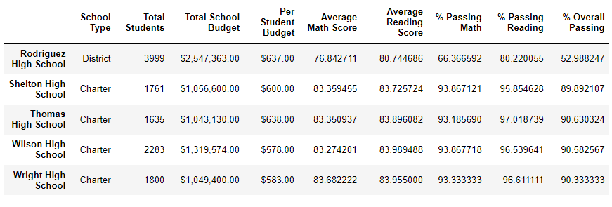

# Pandas_Activities
Using pandas to clean and sort school district data data. 

## Overview

This project analyzes district-wide test results, including schools and their students.  After cleaning the datasets and manipulated, I conducted analysis to gather the following project deliverables:

- A high-level snapshot of the district's key metrics
- An overview of the key metrics for each school
- Tables presenting each of the following metrics:
  - Top 5 and bottom 5 performing schools, based on the overall passing rate
  - The average math score received by students in each grade level at each school
  - The average reading score received by students in each grade level at each school
  - School performance based on the budget per student
  - School performance based on the school size 
  - School performance based on the type of school

## Results 

I manipulated the data dropping the ninth grade math and reading scored for Thomas High School. Below is the insight into how this change affected the overall analysis. 

**Impact on District Analysis**

- The impact was low because on sider there are only 461 students in grade 9 at Thomas High School, and given the total student count is 39,170, the grade 9 students only make up 1.2% of the total student count, so removing their math and reading scores can only impact the averages so much.

Impact on School Summary

- After dropping the 9th grade scores, Thomas High school average test scores and overall score increased by over 25%

*The original summary*:

*The updated summary:*

**Impact on Thomas High School’s performance relative to the other schools**

- The scores for Thomas High School were higher compared to other schools. See screenshot comparison above. Thomas was ranked second in the school district. 

**Impact on:** 

- Math and reading scores by grade

  - It wouldn't affect scores by grade except for ninth grade. Thomas High School did not have any scores for the ninth grade, which eventually skewed overall metrics.  

- Scores by school spending

  - Average scores for the "$630-644" band, which Thomas High School belongs to, would go up. The table below shows results after dropping Thomas High School ninth grade math and reading scores.

  

- Scores by school size

  - Average scores for the "Medium" category, which Thomas High School belongs to, would go up.

- Scores by school type

  - Average scores for the "Charter" school type, which Thomas High School belongs to, would go up. The table below shows results after dropping Thomas High School ninth grade math and reading scores.

  

## Summary

Changing the math and reading scores for Thomas High School significantly skewed the following results:

- School summary: After dropping the 9th grade scores, Thomas High school average test scores and overall score increased by over 25%.
- Thomas High School appeared to perform and rank higher compared to other schools in the district.
- Charter schools had a much higher performance margin compared to district schools.
- The spending by score category "Medium" had higher scores. 

## Resources

- CSVs used: school data and student data

For more information about Python modules and packages, reading CSV files, and using the `head()` and `tail()` methods in Pandas, refer to the following documentation:

- [Importing Python modules and packages (Links to an external site.)](https://www.pythonlikeyoumeanit.com/Module5_OddsAndEnds/Modules_and_Packages.html)
- [Reading a CSV file into a Pandas DataFrame (Links to an external site.)](https://pandas.pydata.org/pandas-docs/stable/reference/api/pandas.read_csv.html)
- [Using .head() on a DataFrame (Links to an external site.)](https://pandas.pydata.org/pandas-docs/stable/reference/api/pandas.DataFrame.head.html)
- [Using .tail() on a DataFrame](https://pandas.pydata.org/pandas-docs/stable/reference/api/pandas.DataFrame.tail.html)
